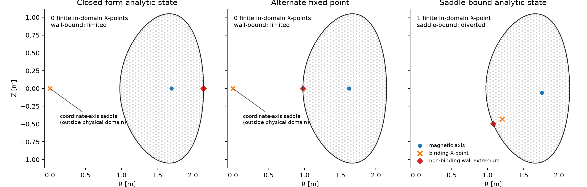

# Topology classification of the banked oracle roots

## Verdict

The two original fixed-point roots remain **limited** in all four stored-precision
reads. Their production boundaries coincide with wall contacts and their fields
contain zero finite in-domain X-points. This still contradicts the earlier claim
that the original closed-form root supplies the diverted class; relabeling either
original receipt would not change its field topology.

The bank now also contains an independently constructed exact Solov'ev-family
state. Its fifth production read is **diverted**, locates exactly one finite
in-domain X-point at `[1.2043590455560238, -0.43060062587647197] m`, and
selects that saddle as the boundary. The additional state therefore supplies the
genuinely diverted member needed for a two-class acceptance test while preserving
the original four limited classifications.

## Original closed-form saddle analysis

For the closed form, `dpsi/dZ = -2*k_z*Z` and
`dpsi/dR = -2*R*G'(R^2-R0^2)`. In the physical cylindrical domain `R > 0`,
`G'` vanishes only at `R = R0`, so the sole physical stationary point is the
magnetic-axis maximum at `(1.7, 0) m`; there is no physical X-point.

Extending the formula to the excluded coordinate axis produces a mathematical saddle at
`(0, 0) m`. Its per-radian Hessian eigenvalues are
`[0.77744086558616043, -0.43965429246500937] Wb/m^2`, with
determinant `-0.34180521369266781`, hence opposite curvature signs. That point
is not a plasma X-point: it lies outside every wall and stored solve lattice. Its
nearest wall-vertex distance is `0.97862926143505558 m` and its nearest
fine-grid node is `0.97952220309003357 m` away. The fine grid starts at
`R = 0.97945194077533482 m`; the wall starts at
`R = 0.97835170363738877 m`.

## Constructed Solov'ev-family saddle

The added total-flux field is
`Phi = a*R^4 + b*Z^2 + c0 + c1*R^2 + c2*Z + c3*R^2*Z
+ c4*(R^4 - 4*R^2*Z^2)` with binary64 coefficients
`[-0.1, -1.6, -0.9717066778084612, 0.5788947452393514, -2.5259948490836557, 0.7418496289071758, 0.014333833567392602]`. The last four non-gauge terms are homogeneous solutions and
`Delta-star(Phi) = 8*a*R^2 + 2*b`, so the field is an exact static
Solov'ev-family Grad-Shafranov state with constant flux-function gradients. The
gauge is fixed by `Phi(X) = 0`; no numerical equilibrium solve or topology label
was used to construct the field.

The analytic magnetic axis is at
`[1.7673817014758004, -0.058660476000218287] m`
with Hessian eigenvalues `[-5.5887675730531665,
-0.11014288991603083] Wb/m^2`, both negative. The analytic X-point is at
`[1.1984053224359039, -0.43408752240161563] m`; its Hessian eigenvalues are
`[-4.4142614511571274, 0.065321197682965404] Wb/m^2` and
its determinant is `-0.28834484487532874 Wb^2/m^4`. The opposite signs
prove a saddle. It is strictly inside the wall polygon, with nearest sampled wall
vertex `0.1335382885813543 m` away. The production locator differs from the
analytic X-point by `0.0068996569746697543 m`.

## Stored-precision production reads

| Resolution | Root | Class | Finite X-points | Binding point [m] | Boundary flux [Wb] | Fixed-point evidence |
|---|---|---:|---:|---|---:|---:|
| coarse | closed form analytic | limited | 0 | `[2.15, 1.148592147035757e-16]` | -8.6736173798840355e-19 | exact closed form |
| coarse | alternate fixed point | limited | 0 | `[0.9783517036373888, -0.0001210354195923481]` | -0.24590656947069361 | 2.4941706048983241e-15 |
| fine | closed form analytic | limited | 0 | `[2.15, 1.148592147035757e-16]` | -8.6736173798840355e-19 | exact closed form |
| fine | alternate fixed point | limited | 0 | `[0.9783517036373888, -0.0007319415012626677]` | -0.24697114012695601 | 2.1720128948495349e-15 |
| fine | diverted analytic | diverted | 1 | `[1.204359045556024, -0.430600625876472]` | -1.4844865419477442e-06 | exact polynomial |

The locator used its float64 local quadratic fit on unchanged binary64 bank arrays.
Input SHA-256 identities were checked against each source receipt before
classification. Neither receipt label was used as a classification input, and no
nonlinear solve was run. The raw field gauge was retained separately for each state;
its axis, wall, and boundary values were all read from that same field.

For the added fixture, the binary64 state has shape `[4052]` and
SHA-256 `11a7e9d00556e91a6d76a69212107592501e1e8cedae60fd17e9e8032ff14801`. Its coefficient array SHA-256 is
`02c5c5b60d2fdc4ff6fa09ff3889b38bd0f4f64e9871a3bb5c29df43a7c7a215` and its two-row analytic stationary-point array
SHA-256 is `9919d9b2fb5b262f49bfaee0fec3571bd687b65812269b0f9db27cfcfe2ccbf1`. The diverted boundary is separated
from the wall extremum by `0.14059053998403737 m`, and its boundary-minus-
wall flux is `-0.00059266764486217674 Wb`; both nonzero reads distinguish
the saddle-bound separatrix from a wall contact at stored precision.

The independent root separation is retained: the coarse axes differ by
`74.8388723 mm` and the fine axes by
`74.1888564 mm`. The alternate roots remain criterion-qualified at
relative residuals `2.4941706048983241e-15` and `2.1720128948495349e-15`. Distinct
fixed points do not imply distinct topology classes.

## Acceptance implication

The original root pair can exercise two distinct fixed points and same-class
portfolio behavior. The added exact state supplies an independent diverted oracle,
so the combined bank is ready to exercise both limited and diverted acceptance.
The two roles remain separate: the added state proves topology classification, not
a second nonlinear fixed point of the original closed-form carrier.

Machine-readable receipts: `diverted-receipt.json` and
`topology-classification.json`.
