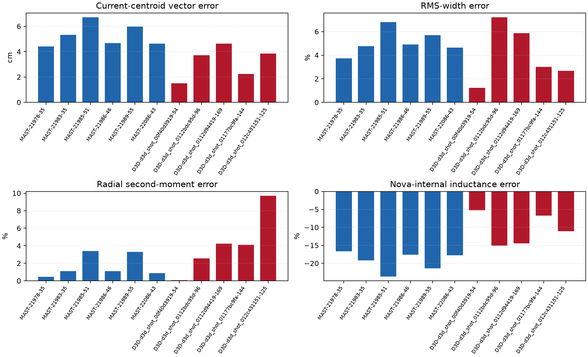
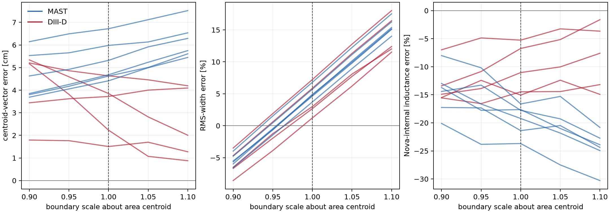

# Moment-prediction confidence on frozen benchmark frames

## Outcome

The boundary-only predictor was measured on **11 frozen frames** (six MAST and five score-blind DIII-D) at **five boundary scales**, for **55 tree-stamped rows**. Net current is exact by explicit common-amplitude elimination; that is a structural constraint, not evidence that the source shape was predicted.

At each reference's own boundary, the all-frame median absolute current-centroid vector error is **4.62 cm** (p90 5.98 cm), the median RMS-width error is **4.77%**, and the median Nova-internal inductance-class error is **16.6%**.

| Cohort | Frames | Median centroid error | Median RMS-width error | Median radial second-moment error | Median Nova-internal inductance error |
| --- | ---: | ---: | ---: | ---: | ---: |
| MAST | 6 | 5 cm | 4.84% | 1.1% | 18.5% |
| DIII-D | 5 | 3.72 cm | 3% | 4.12% | 11% |
| All | 11 | 4.62 cm | 4.77% | 2.56% | 16.6% |

## Boundary sensitivity

The sensitivity ladder contracts or expands each reference boundary about its own area centroid by 10%, 5%, 0%, 5%, and 10%. Across frames, the median full-ladder radial-centroid range is **1.66 cm**, the vertical-centroid range is **0.115 cm**, the RMS-width fractional range is **21%**, and the Nova-internal inductance fractional range is **9.45%**.

## Support contract and the 0.4469 hazard

Every TSV prediction declares `boundary_hypothesis_all_domain`; every oracle row declares `reference_boundary_all_domain`. No row is presented as a topology-qualified confined-core prediction. The audited MAST support control is **0.446884** confined-core current over all-domain target current (416958.254 A / 933034.875 A). Applying these all-domain predictions to `IntegralObservation`'s confined-core constraint would therefore be a support error before any prediction error is considered.

## Method and qualifications

- The predictor uses only the prescribed `DomainProfile.current_density`, the declared net current, and a boundary hypothesis. A squared centroid-to-boundary distance coordinate supplies the missing normalized-flux field. No nonlinear solve or Nova API addition is involved.
- The reference oracle evaluates the same prescribed source on the frame's labelled normalized-flux map and the reference boundary, then applies the same target-current amplitude elimination. Thus the measured error isolates loss of the interior flux coordinate, not a source-profile mismatch.
- MAST uses stored `efm/pprime` and `efm/ffprime`. DIII-D uses the existing `map_extraction` path to recover those functions from each score-blind labelled map; its errors are therefore an optimistic, label-derived control rather than an independent source forecast.
- Second-moment content is reported as current-weighted radial/vertical variances, covariance, RMS width, and a Nova-internal inductance proxy. The latter projects each current image through Nova's finite-cell Green kernel and applies Nova's poloidal-field/volume instrument.
- No published EFIT inductance is scored. The divided-out column is `predicted_internal_inductance_nova / reference_internal_inductance_nova`, so the same instrument appears in numerator and denominator. The banked instrument control remains 0.602024 on the reference map, while its divided-out same-instrument comparison is 0.999427; this qualification must remain attached to any inductance-class use.
- The source tree and every immutable input digest are recorded in the JSON summary; every TSV row repeats the source commit and tree.

## Interpretation for constraint promotion

Net current is available with exact structural confidence because the amplitude is supplied and eliminated. The centroid, second-moment, and inductance-class numbers above are empirical all-domain errors and boundary sensitivities, not confined-core guarantees. No numeric promotion threshold was declared for this study, so the report does not silently convert them into a solve constraint. A later constraint decision must state a tolerance and either remain all-domain or first supply a topology-qualified support mapping.

## Artifacts

- Tree-stamped table: `/home/ITER/mcintos/Code/.reckon-worktrees/nova-a0f1e0938fc2/47247cc9-be75-4e83-a22e-ed27792dda52/moment-prediction-confidence/scripts/moment_prediction_confidence/moment-prediction-confidence.tsv`
- Machine-readable summary: `/home/ITER/mcintos/Code/.reckon-worktrees/nova-a0f1e0938fc2/47247cc9-be75-4e83-a22e-ed27792dda52/moment-prediction-confidence/scripts/moment_prediction_confidence/moment-prediction-confidence.json`
- Figures: `docs/figures/moment-conditioned-basin-entry/reference-boundary-errors.png` and `docs/figures/moment-conditioned-basin-entry/boundary-sensitivity.png`
- Source commit: `1583381cb1747ca9242af423b97e28cf9396af63`; source tree: `dc3c1a4b4642c875aaf6aa1a0da5b4df457332b6`.
