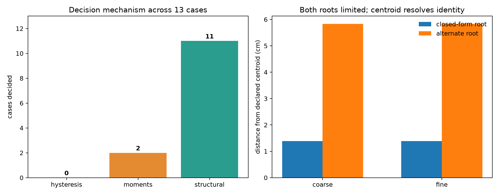
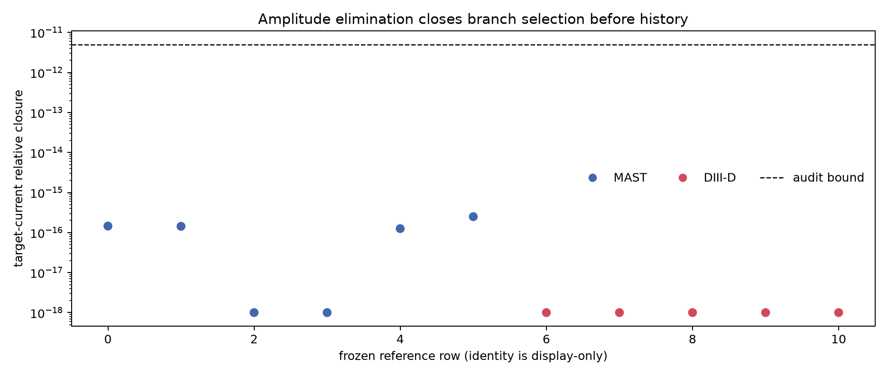

# Portfolio and moment selection revisit

## Outcome

The study contains **13 cases**: two mesh resolutions of the banked same-class dual-root fixture and eleven frozen current-constrained references. Portfolio hysteresis changed **0 of 13** outcomes. The moment discriminator decided **2** cases and structural amplitude elimination decided **11**.

Both banked roots are limited at coarse and fine resolution, so a topology-class hysteresis receipt cannot identify one root over the other. Their radial-current centroids are separated by **7.219 cm**. Against the declared centroid, the closed-form root is **1.387 cm** away and the alternate root is **5.833 cm** away; the centroid therefore selects the closed-form root on both meshes.

Across all eleven frozen references, exact target-current closure is at most **2.495e-16**. The nonzero-current amplitude elimination removes the vacuum branch from the admissible map range before post-solve history can act. Reference identity is retained only as provenance and plot labeling; the decision function receives only candidate count, candidate class, and numerical centroid errors.

## ROLE RESTATEMENT

ROLE RESTATEMENT — The topology-pinned two-branch portfolio remains a topology-discovery and transition-safety mechanism where genuinely limited and diverted solutions coexist. It is not a root-identity selector for same-class multiple roots, and it does not earn a second solve on current-constrained reference lanes where amplitude elimination leaves one admissible plasma branch. In this measurement, predicted centroid moments resolve the two same-class fixture cases, while structural current constraint resolves all frozen reference cases before history can act. Hysteresis remains the policy only when both topology-pinned classes are simultaneously valid and admissible and topology history is genuinely informative.

## Reproduction

Run `python scripts/portfolio_moment_revisit/run.py` and then `python scripts/portfolio_moment_revisit/verify.py` from the repository root. The JSON receipt records every input digest and every case-level decision.
